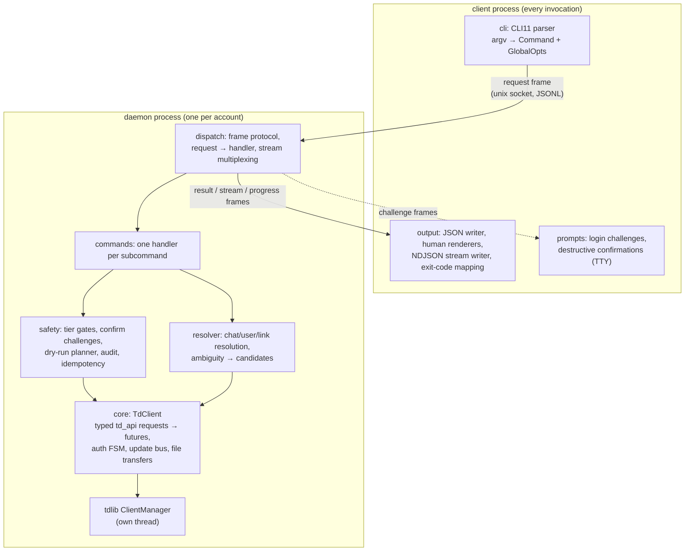

# tgcli — Design Document

A fast, single-binary Telegram CLI built in C++ on [tdlib/td](https://github.com/tdlib/td),
designed for two audiences at once:

1. **Humans** — a pleasant everyday terminal tool: read, search, send, manage
   your Telegram from the shell with minimal ceremony.
2. **AI agents** — a machine-first mode: plain JSON output, meaningful exit
   codes, a sandboxing switch, streaming primitives (`listen`, `wait-for`),
   and non-interactive auth paths.

Status: design phase. Nothing below is implemented yet.

## 1. Goals and non-goals

### Goals

- Full-featured control of the user's own account (and optionally bot
  accounts): read, search, send, edit, media, folders, topics, chat
  administration, sessions.
- Fail-closed writes: anything that acts on Telegram on behalf of the account
  is gated behind an explicit grant — per call, per environment, or granted
  once per account (§6). Reads are always free; a grantless invocation is
  read-only by construction.
- Low-ceremony manual use: the account owner grants writes once in config
  (`allow_write = true`) and `tgcli send @user "hi"` just works — no cache
  warm-up, no confirmation tax on routine actions.
- First-class agent ergonomics: structured errors, deterministic exit codes,
  streaming/wait primitives, non-interactive auth.
- Single static binary, fast startup, no runtime dependencies — trivially
  deployable into agent sandboxes and containers.
- Multi-account with fully isolated state per account.

### Non-goals

- Not a TUI/chat client (no ncurses UI).
- Not an MTProto library — all protocol work is delegated to tdlib.
- No custom message cache: tdlib's own database *is* the cache.
- Bot-platform features (inline keyboards, payments, webhook-style serving)
  are out of scope for v1; basic bot-token login is in scope.

## 2. Design drivers: lessons from existing Telegram CLIs

Existing Telegram CLIs — typically Python tools built on a client library
with a bespoke local message cache — share a set of UX flaws this design
deliberately avoids:

- **Manual cache management** (explicit sync/backfill steps before any read)
  — the single biggest friction, made worse when backfill is a blunt sweep of
  the top-N active dialogs with no way to target a specific chat or depth. tdlib
  eliminates the ceremony: reads are transparently served from tdlib's local
  DB and fetched from the server on miss; for deliberate warming there is an
  explicit, precisely targeted `tgcli fetch <chat>` (§4).
- **Local-only reads**: every query ran against the local cache; there was no
  server-side search at all, so results silently depended on cache freshness.
  tgcli defaults to live server-side operations (per-chat and global search
  included) with `--local` as the explicit offline option.
- **Bespoke SQLite store with a hardcoded schema** — a migration liability on
  every upgrade. tgcli keeps *no* message store of its own: tdlib owns its
  database and migrates its schema across versions itself. tgcli's only
  persistent state is an append-only JSONL audit log and a tiny versioned
  idempotency store (§8).
- **`listen` streamed to stdout without persisting, and there was no
  wait-by-filter primitive.** In tgcli persistence is decoupled from
  streaming: tdlib writes everything it observes into its DB regardless (the
  daemon keeps it continuously warm), `listen` is just a live view, and
  `wait-for` covers "block until a matching message/event arrives".
- **Envelope tax**: every JSON response wrapped in `{"ok": …, "data": …}`
  forces `jq .data` on every call. tgcli prints the data itself.
- **Flat 60+-verb namespace** (`folders-list`, `chat-invite-link`, …) is hard
  to discover. tgcli uses grouped subcommands plus a small set of flat
  everyday verbs.

What tdlib brings over building on a raw MTProto client library, independent
of UX:
server-side full-text search, consistent local state maintained via updates,
flood-wait handling largely inside the library, secret-chat capability, and a
single static binary with ~instant startup.

## 3. UX principles

- **Everyday verbs are flat, the long tail is grouped.** `tgcli read @chat`,
  `tgcli send @chat "hi"`, `tgcli search foo` — no noun prefix for the
  operations that account for 95% of invocations. Administrative and rare
  operations live under nouns: `tgcli chat …`, `tgcli msg …`, `tgcli folder …`,
  discoverable via `tgcli <noun> --help`.
- **TTY-adaptive**: human tables/colors on a TTY; `--json` (or non-TTY
  auto-detection is *not* used — output format never silently changes) for
  machines. `NO_COLOR` and `--no-color` respected.
- **stdout is data, stderr is commentary.** Progress, warnings, and
  diagnostics never contaminate stdout in either mode.
- **No command requires a TTY except interactive `login`**; every prompt has a
  flag/env/config alternative.
- **Errors are data**: structured error objects with a machine-readable code,
  never just prose.
- **Fast by default**: no network round-trips for what the local tdlib DB can
  answer; `--local` forces offline-only reads.

## 4. Command surface

Global flags:

```
--account <name>       account selection (default from config / TGCLI_ACCOUNT)
--json                 machine output (plain JSON / NDJSON for streams)
--allow-write          per-call write grant (see §6 for env/config grants)
--dry-run              resolve and validate, print the plan, call nothing
--yes                  non-interactive approval of destructive actions
--timeout <sec>        per-command deadline (default 60; streams: unlimited)
--idempotency-key <k>  replay a recorded success instead of re-sending (§6)
--verbose / -v         diagnostics to stderr
--no-color
```

### Everyday commands (flat)

```
tgcli login [--qr] [--bot-token <token>]
tgcli logout                                      destructive (§6)
tgcli me
tgcli doctor                                      auth state, tdlib version, paths, DB sizes, daemon state

tgcli chats [--folder <f>] [--archived] [--unread] [-n N]
tgcli read <chat> [-n N] [--before <msg-id>] [--since TS] [--until TS]
              [--topic <id>] [--local]           (alias: history)
tgcli send <chat> [TEXT | -] [--file PATH]... [--caption TEXT]
              [--md | --html] [--reply-to ID] [--topic ID]
              [--silent] [--schedule <ts|"online">] [--spoiler]
tgcli search <query> [--chat <c> | --global] [--from <user>]
              [--type text|photo|video|doc|link|voice] [-n N] [--local]
tgcli unread                                      per-chat unread counters
tgcli fetch <chat> [--limit N | --all] [--since TS]
              deliberately warm the local DB with history for one chat
              (pages getChatHistory; enables later --local / offline work);
              progress on stderr, resumable, per-chat and per-depth targeting
tgcli download <chat> <msg-id> [-O <dir|path>]    progress on stderr
tgcli resolve <t.me-link | @username | title>     → ids, type, metadata

tgcli listen [--chat <c>]... [--types message,edit,delete,reaction,chat]
              [--timeout S] [--count N]           NDJSON stream, one update per line
tgcli wait-for [--chat <c>] [--from <user>] [--regex <re>] [--timeout S]
              blocks until one matching message arrives, prints it, exits 0;
              exits 7 (TIMEOUT) otherwise — the primitive for
              "send, then wait for the reply" agent loops

tgcli raw '<td_api request JSON>' [--timeout S]   full-API escape hatch (§4.2)
```

### Grouped commands (long tail)

```
tgcli msg get <chat> <id>...
tgcli msg edit <chat> <id> <TEXT | ->
tgcli msg delete <chat> <id>... [--for-all]       destructive
tgcli msg forward <from> <id>... <to> [--drop-author]
tgcli msg react <chat> <id> <emoji> [--remove] [--big]
tgcli msg pin|unpin <chat> <id>
tgcli msg link <chat> <id>                        → t.me permalink

tgcli chat info <chat>
tgcli chat members <chat> [--admins|--bots|--query <q>] [-n N]
tgcli chat join <invite-link | @username>
tgcli chat leave <chat>                           destructive
tgcli chat mark-read <chat>
tgcli chat mute|unmute <chat> [--for <duration>]
tgcli chat pin|unpin|archive|unarchive <chat>
tgcli chat set-title|set-photo|set-description <chat> <value>
tgcli chat invite-link <chat> [--revoke]
tgcli chat promote|demote <chat> <user> [--rights ...]
tgcli chat ban|unban|kick <chat> <user>           ban/kick destructive
tgcli chat set-permissions <chat> [--flags ...]

tgcli contact list|search <q>|add|remove|block|unblock
tgcli folder list|show <f>|create|edit|delete|add-chat|remove-chat
tgcli topic list <chat> | create|edit|close|reopen <chat> ...
tgcli session list | terminate <id>               terminate destructive
tgcli account add|list|show|use|remove <name>
tgcli daemon status|stop|restart|run              lifecycle (§10); auto-spawned otherwise,
                                                  `run` stays in the foreground
tgcli completion <shell>
tgcli version
```

### 4.1 Selectors

`<chat>` accepts `@username`, a numeric tdlib chat id, a `t.me/...` link, or a
title substring. Title resolution uses tdlib `searchChats` (plus
`searchPublicChat` for unseen `@usernames`). An ambiguous title fails with
exit 2 and a `candidates` list in the error object, so a human or an agent can
retry with a precise id. `<user>` follows the same rules against
contacts/chat members.

Message ids are **tdlib message ids** everywhere (they differ from server ids
for channel posts). `msg link` / `resolve` convert to/from public t.me
references, so nobody needs to know about the id-space difference.

### 4.2 `raw` escape hatch

Direct passthrough to the td_api schema (`@type`-keyed JSON, the same
convention as td_json_client): guarantees full API coverage before a dedicated
subcommand exists. `raw` passes through the same write gate (§6): request
types outside a known-read-only allowlist count as writes and require a
write grant.

## 5. Output contract

**No envelopes.** In `--json` mode a successful command prints the result
object itself to stdout:

```json
{"id": 123456, "chat_id": -1001234, "date": "2026-07-02T12:00:00Z", "text": "hi", ...}
```

List-returning commands print `{"items": [...], "next": <cursor|null>}` —
pass `next` back via `--before`/`--offset` for deterministic pagination.
Streams print one JSON object per line (NDJSON).

Failures print a single error object to **stderr** and set the exit code:

```json
{"error": {"code": "AMBIGUOUS", "message": "3 chats match 'dev'", "candidates": [...]}}
```

- Result schemas are **curated and stable** per command (documented in
  `docs/schemas/`), not raw td_api dumps; `--full` adds the underlying td_api
  object under a `raw` key.
- Human output renders the same data — no information exists in one mode that
  the other lacks.
- Warnings go to stderr (prefixed `warning:` in human mode, NDJSON
  `{"warning": …}` objects in `--json` mode).

### Exit codes

| code | name | meaning |
|---|---|---|
| 0 | OK | success |
| 1 | GENERIC | unclassified error (tdlib error details on stderr) |
| 2 | USAGE | bad arguments, unknown selector, ambiguous resolve |
| 3 | NOT_AUTHED | not logged in → `tgcli login` |
| 4 | NOT_FOUND | chat/message/user/file not found |
| 5 | RATE_LIMITED | Telegram flood wait surfaced; `retry_after` in error details |
| 6 | DENIED | write attempted without a grant, or destructive action without confirmation |
| 7 | TIMEOUT | `--timeout` elapsed (`wait-for`, downloads, raw) |

## 6. Safety model

Three tiers, enforced in one chokepoint (§7 `safety` layer, evaluated
daemon-side); each command handler statically declares its tier so a gate
cannot be forgotten:

- **Reads** — always allowed, no grant needed.
- **Writes** — anything that acts on Telegram on behalf of the account (send,
  edit, react, mark-read, mute, folder edits, …) is **denied by default**
  (exit 6). It runs only under an explicit write grant, any of:
  - `--allow-write` — per call;
  - `TGCLI_ALLOW_WRITE=1` — per environment (a shell session, a CI job, an
    agent harness that is trusted to write);
  - `allow_write = true` in the account's config — granted once by the
    account owner for ceremony-free everyday use of their own account.
- **Destructive** (msg delete, chat leave/ban/kick, session terminate, folder
  delete, logout) — requires a write grant *and* confirmation: on a TTY an
  interactive prompt showing the resolved target
  (`leave chat "Dev Team" (-1001234)? [y/N]`); without a TTY an explicit
  `--yes`.

The default is therefore fail-closed: an agent invoked with no grant in its
environment has a read-only surface by construction and receives a
structured exit-6 error the moment it strays. The gate guards against
accidental and unauthorized-by-omission writes, not against a hostile
process running as the same uid (§10).

Supporting mechanisms:

- **`--dry-run`** — performs resolution and validation, prints the exact plan
  (resolved ids, message preview, td_api request type), calls nothing.
- **Audit log** — every state-changing invocation appends a JSONL record
  (argv, resolved targets, outcome) to the account's `audit.log`.
- **`--idempotency-key <k>`** — records successful writes keyed by `k`; a
  replay returns the recorded result without calling Telegram. Makes
  retry-on-transport-error loops safe from double-sends.

## 7. Architecture

One binary, two roles: every invocation is a thin **client**; the tdlib
client lives in a per-account **daemon** (auto-spawned, §10). The role is an
argv detail (`tgcli daemon run` is the daemon entrypoint), all code ships in
the same binary.



Layer responsibilities:

- **client** — parses argv, opens (or spawns) the account daemon, sends one
  request frame, renders response frames, maps the terminal frame to an exit
  code. Owns the TTY: challenge frames (login secrets, destructive
  confirmations) are prompted client-side and answered back over the socket.
- **dispatch** — the daemon-side protocol endpoint: frames in/out, concurrent
  requests, subscription multiplexing (many `listen`/`wait-for` clients over
  one update bus).
- **core (`TdClient`)** — owns the tdlib `ClientManager` receive loop on a
  dedicated thread. Exposes `send(td_api::object_ptr<Fn>) → future<Result>`
  with request-id correlation, an update bus (typed subscriptions used by
  `listen`/`wait-for`/file progress), and the authorization state machine.
  Nothing above this layer touches tdlib type lifecycle rules.
- **resolver** — selector strings → ids, cached per request; produces the
  `candidates` payload on ambiguity.
- **safety** — the single chokepoint (§6), evaluated daemon-side. Handlers
  *declare* `Tier::Read|Write|Destructive` in their static descriptor.
- **commands** — thin: validated args in, a few `TdClient` calls, curated
  result JSON out, plus a human renderer (rendering happens client-side from
  the same curated data).
- **output** — the only code that writes to the client's stdout.

### tdlib interface choice

tgcli uses tdlib's **native typed C++ interface** (`td::td_api`) for all
implemented commands — compile-time schema safety — and tdlib's JSON
conversion layer (`td_api_json`) for the `raw` command and `--full` dumps.
tdlib is built from a pinned source revision as part of the build (§13), so
the availability of the JSON conversion headers is under our control.

The huge `td_api.h` header is confined to `core/` translation units and a
precompiled header to keep incremental builds tolerable.

## 8. tdlib integration details

- **Auth FSM**: driven by `updateAuthorizationState`:
  `waitTdlibParameters → waitPhoneNumber → waitCode → [waitPassword] → ready`.
  Interactive `login` prompts reach the invoking client as challenge frames
  (§10) and are answered from its TTY (password without echo);
  `--qr` uses `requestQrCodeAuthentication` and renders the QR in the
  terminal; `--bot-token` uses `checkAuthenticationBotToken` (fully
  non-interactive — the recommended path for disposable agent accounts). The
  2FA password can come from `password_cmd` in config (e.g. `pass show …`)
  for scripted re-auth; secrets are never accepted via argv.
- **Every other command** requires `authorizationStateReady`; anything else →
  exit 3 with the current state named in the error details.
- **Request correlation**: `ClientManager::send(client_id, query_id, fn)`;
  `TdClient` hands out monotonic query ids and resolves the matching promise
  on receive. Updates (query_id 0) go to the update bus.
- **Files**: `downloadFile` + `updateFile` progress events → progress bar on
  stderr (TTY) or NDJSON progress frames. Uploads via `inputFileLocal` inside
  send requests, same plumbing.
- **Flood waits**: tdlib retries most floods internally; a surfaced 429 maps
  to exit 5 with `retry_after`.
- **Local DB and persistence**: tdlib persists every chat, message and update
  it observes into its own database and migrates that schema across tdlib
  versions itself — tgcli never defines a message schema and has no
  migration story to maintain for messages. tgcli's own persistent state is
  deliberately trivial: an append-only JSONL audit log (no schema to migrate)
  and a small idempotency store carrying an explicit `schema_version`. The
  per-account daemon (§10) keeps running by default, so the local DB absorbs
  updates continuously; `listen` is a live view over that stream, not the
  persistence mechanism.
- **Local-only reads**: `--local` on `read`/`search` sets the `only_local`
  flag on `getChatHistory` / searches only the DB — offline mode for agents
  that must not hit the network. `tgcli fetch` is the deliberate warming
  path: it pages `getChatHistory` for one chat to a requested depth/date,
  resumable, with progress on stderr.
- **Options at startup**: `ignore_background_updates=false` (keep the DB
  warm), `notification_group_count_max=0` (no notification machinery).
- **tdlib logging**: to a file in the account state dir at verbosity 1 by
  default; `-v` raises verbosity and mirrors to stderr.

## 9. Configuration, paths, secrets

XDG layout, one subtree per account:

```
~/.config/tgcli/config.toml                    global + per-account config
~/.local/share/tgcli/accounts/<name>/tdlib/    tdlib database + files
~/.local/state/tgcli/accounts/<name>/          audit.log, idempotency.db, tdlib.log
$XDG_RUNTIME_DIR/tgcli/<name>.sock             daemon socket
```

`config.toml`:

```toml
default_account = "main"

[accounts.main]
api_id       = 12345                             # plain values are the normal path;
api_hash     = "0123456789abcdef"                # `tgcli login` saves them on first run
db_key_cmd   = ""                                # optional tdlib database_encryption_key source
password_cmd = ""                                # optional 2FA password source
allow_write  = false                             # standing write grant for this account (§6);
                                                 # default deny — grant per call/env otherwise
```

Environment (env beats config): `TGCLI_ACCOUNT`, `TGCLI_API_ID`,
`TGCLI_API_HASH`, `TGCLI_ALLOW_WRITE`, `TGCLI_MEDIA_DIR`.

Credentials policy — two classes, treated differently:

- **App credentials (`api_id`/`api_hash`)** are *not* account secrets: they
  identify the application, grant no account access without the user's own
  auth, and are less sensitive than the tdlib directory sitting next to them
  (which holds the MTProto auth key — the real crown jewel). They live as
  plain values in `config.toml`; `tgcli login` prompts for them on first run
  (or takes `TGCLI_API_ID`/`TGCLI_API_HASH`) and persists them. `api_id_cmd`/
  `api_hash_cmd` hooks remain available for those who prefer a secret store.
  tgcli does not embed shared app credentials in the binary: publishing an
  api_hash is against Telegram's guidance and one abusive user could get the
  shared app id rate-limited or banned for everyone.
- **Real secrets (2FA password, DB encryption key)** are accepted only via
  `*_cmd` config hooks or interactive prompt — never via argv (visible in
  `ps`) and never written to disk by the tool.

Protection of the account state rests on file permissions (config `0600`,
account dirs `0700`) and optionally on tdlib's at-rest encryption via
`db_key_cmd` — which covers the auth key and message DB, a strictly more
valuable target than the app credentials.

## 10. Process model: per-account daemon

Hard tdlib constraint: **one tdlib database directory — one client process**.
tgcli embraces it instead of working around it: the tdlib client lives in a
per-account daemon from day one, and every invocation is a thin client over
the account's unix socket. Consequences: ~zero CLI startup latency (no tdlib
DB open per command), safe concurrent invocations, any number of simultaneous
`listen`/`wait-for` subscribers, and a local DB that stays continuously warm.

- **Auto-spawn, zero setup.** A command that finds no live socket forks the
  daemon (re-execs itself as `tgcli daemon run --account <name>`), waits for
  a readiness handshake, and proceeds. Spawn races are settled by an `flock`
  on the account dir: the loser just connects to the winner's socket.
- **Lifecycle.** The daemon keeps running by default — a continuously warm
  DB is a feature, not a leak; `idle_exit = <seconds>` in the account config
  opts into terminate-when-idle. `tgcli daemon status|stop|restart` manage
  it; `tgcli daemon run` stays in the foreground for systemd user units,
  containers, and debugging.
- **Protocol.** JSONL frames over a `SOCK_STREAM` unix socket. Request frame:
  id, command path, normalized args, client context (TTY-ness, `--json`,
  `--allow-write`, `--yes`, `--dry-run`, timeout). Response frames: `result`,
  `error`, `item` (streams), `progress`, and `challenge`. Interactive flows
  are challenge/response: the daemon asks (login code, 2FA password,
  destructive confirmation), the client prompts on *its* TTY and answers;
  with no TTY a challenge fails closed (exit 3 for auth, 6 for confirmation).
  Multiple requests are served concurrently; a slow download never blocks a
  `send` from another shell.
- **Security.** Socket at `$XDG_RUNTIME_DIR/tgcli/<name>.sock`, mode 0600,
  `SO_PEERCRED` uid check. The write gate (§6) is evaluated in the daemon:
  a write-tier request runs only if the account config grants `allow_write`
  or the request itself carries a grant. Per-invocation grants are client
  declarations within the same uid trust domain — the gate is a guard
  against accidents, not against a hostile local process.
- **`--no-daemon`.** Debugging escape hatch: runs dispatch and handlers
  in-process over the same code path minus the socket; refuses to start if a
  daemon already holds the account lock.

## 11. Multi-account

`tgcli account add work && tgcli --account work login` — each account has an
isolated config section, tdlib dir, state dir, and socket. `account use` sets
`default_account`. Nothing is shared between accounts, including idempotency
stores and audit logs.

## 12. Agent ergonomics checklist

What makes tgcli specifically LLM-agent-friendly:

- Exit codes are the control flow — agents branch without parsing prose.
- Writes fail closed: with no grant in the environment every mutating command
  exits 6 with a structured error — a harness that grants nothing gets a
  read-only agent by construction; a harness that sets `TGCLI_ALLOW_WRITE=1`
  (or lets the agent pass `--allow-write` per call) opts into writes
  deliberately.
- The per-account daemon gives ~zero per-call startup latency and makes
  parallel tool calls safe (no DB-lock failures), with the local DB
  continuously warm for `--local` reads.
- `--dry-run` lets an agent present a plan for human approval before writing.
- Destructive actions are non-interactive-safe: without a TTY they fail
  closed (exit 6) unless `--yes` is explicit in the call.
- `wait-for --regex --timeout` turns "message someone and await the reply"
  into one blocking call with a deterministic timeout exit code.
- `listen --json --count N --timeout S` gives bounded streaming reads.
- `--idempotency-key` makes retries safe.
- `raw` guarantees no capability cliff: anything td_api can do is reachable.
- Stable curated schemas under `docs/schemas/` that an agent skill can pin to.
- `tgcli doctor --json` is a one-call health/auth probe.

## 13. Build, dependencies, testing

- **Language/std**: C++20. **Build**: CMake ≥ 3.24 with presets.
- **tdlib**: pinned source revision (tdlib tags rarely; pin a commit hash),
  built via FetchContent by default; `-DTGCLI_SYSTEM_TDLIB=ON` to use an
  installed one. ccache strongly advised; CI caches the tdlib build keyed by
  the pinned hash.
- **Libraries** (FetchContent, permissively licensed): CLI11 (nested
  subcommands), nlohmann/json, fmt, tomlplusplus, Catch2.
- **Testing** (policy detailed in CLAUDE.md; tests pin the external
  contract, never the implementation):
  - Contract tests as the default: a command driven through the real
    dispatch path (`--no-daemon`) against one shared scripted fake of the
    td_api boundary, asserting emitted td_api requests as data, output JSON
    against docs/schemas/, exit codes, stderr discipline. Cross-command
    semantics (write gate, NOT_AUTHED, ambiguity, timeouts) are tested once
    centrally, not per command.
  - Unit tests only for real logic (resolver matching, tier evaluation,
    frame codec, cursors, idempotency replay); no mock-verification tests.
  - Golden files for human renderers.
  - E2E: a small opt-in suite (`TGCLI_TEST_DC=1`) against Telegram's **test
    DC** (`use_test_dc`), which provides synthetic phone numbers with fixed
    login codes — real end-to-end auth/send/read without a real account;
    roughly one flow per feature area.
- **CI (GitHub Actions)**: Linux + macOS build/test matrix, clang-format and
  clang-tidy checks, tdlib build cache, release job producing a static (musl)
  Linux binary and a macOS universal binary.

## 14. Roadmap

Milestones (tracked in TODO.md):

- **M0** — scaffold + process model: CMake + presets, deps, CI, tdlib builds;
  auto-spawned daemon, socket protocol skeleton; `tgcli version` / `tgcli
  doctor` round-trip through the daemon reporting the tdlib version.
- **M1** — auth: challenge/response login over the protocol (phone/QR/bot),
  logout, me, accounts; auth FSM; daemon lifecycle commands
  (status/stop/restart/run, idle_exit).
- **M2** — read path: chats, read, msg get, search, unread, resolve, fetch;
  resolver, JSON/human output, exit codes.
- **M3** — safety layer + write path: send/edit/delete/forward/react/
  mark-read/pin, two-phase destructive confirmation over the protocol,
  audit log, idempotency, dry-run.
- **M4** — files: download/upload with progress frames, media types.
- **M5** — streaming: multiplexed update subscriptions, listen, wait-for.
- **M6** — folders, topics, contacts, chat admin, sessions.
- **M7** — raw passthrough, shell completions, man pages, packaging (static
  binaries, AUR, Homebrew), docs/schemas freeze → v1.0.
- **Post-1.0 ideas**: MCP server mode (`tgcli mcp` over stdio), secret chats,
  scheduled-message management, message translation.

## 15. Open questions

- License (MIT vs Apache-2.0) — must be compatible with linking tdlib (BSL-1.0).
- Whether `chat create` (new groups/channels) belongs in v1 scope.
- Windows support: tdlib supports it, but the process model assumes unix
  sockets and fork/exec; a Windows port needs named pipes and
  CreateProcess — deferred until asked.
